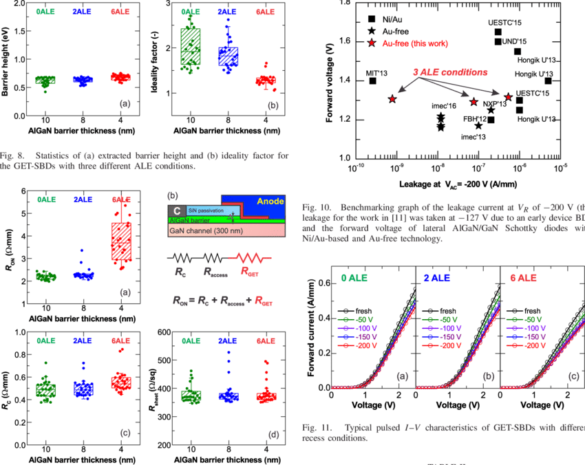

```{r setLicense, child = 'license.Rmd'}
```

# Introduction

## Outline

- Introduction
    + Who are we ("we"=teachers & students)
    + Why are we here (Why learn R?) 
- How will we proceed: Methodology
- HW Data Science approach to using R
- References & Resources


## Who are we (1): The Statistics and Bioinformatics Unit

\begin{figure}
\includegraphics[width=0.85\linewidth]{images/ueb-Unit.jpg}
\end{figure}

## Who are we (2): Teachers

\begin{figure}
\includegraphics[width=0.85\linewidth]{images/ueb-People.jpg}
\end{figure}

<!-- ## Who are we (3): The GRBio Research group -->

<!-- \begin{figure} -->
<!-- \includegraphics[width=0.85\linewidth]{images/GRBio.jpg} -->
<!-- \end{figure} -->

## Why this course (1)

\begin{figure}
\includegraphics[width=0.5\linewidth]{images/drowningindata.jpg}
\end{figure}

"We are drowning in information but starving for knowledge"

## Why this course (2)

- (Biomedical) research, as well as many other human activities (social networks, sports, COVID ...) generate huge quantities of -often complex-  data.
    + Although sometimes we will also have small datasets
- We believe that data leads to information that leads to knowledge, but we need to be able to extract one from the other.
- This can be attempted in many ways, artificial intelligence, machine learning, data science or something which is common to all of them: __plain statistics__!!!
    
## What are our goals (1)

- The main goal of this course is to introduce a variety of statistical methods and tools, which is good enough to:
    + Help you analyze your own data when it makes sense
    + Suggests you when the analysis is complex enough to contact an expert statistician (such us those in the UEB)
    + Help you to distiguish one from the other
    
<p></p>

- A secondary, but not least important objective: Show how to do it using R

## Course contents

- This is a Standard course on Statistics using R
    - Exploratory Analysis
    - Introduction to Inference
    - Common regression models in biostatistics
    
- If there is anything else you would like to learn, let us know and we'll try not to let it out.


## Why learn R

- Most people in most jobs have to _manage_ information in their every day work.
- "Managing" may mean different things such as: 
    + _retrieving_
    + _manipulating_
    + _visualizing_
    + _analyzing_
    + _reporting_
    
- R is a powerful tool that can be used to facilitate, improve or automate tasks such as those described above.

## Why doing statistics with R

- R has become a "de facto" standard for statistical analysis
- Practically all existing statistical methods available
- Powerful graphics that can be used interactively to explore data
- Possibility of scripting analysis $\longrightarrow$  __Reproducibility__

```{r R4statistics, echo=FALSE, fig.cap="R for statistical Analysis and Graphics", out.width = '50%'}

```

## Hadley Wickam's approach to learning and applying Data Sciendce

\begin{figure}
\includegraphics[width=1\linewidth]{images/data-science.png}
\end{figure}


## Your turn

- Provide examples of informations you may wish to manage
- Describe briefly 
    + what this information is about
    + how it is stored
    + what you may wish to do with it
        - Transformations
        - Computations
        - Reports

## How we will work

- Mastering R requires as many other disciplines
    (i) Time 
    (ii) Study, and 
    (iii) Practice.
    
- Our lectures will have the following structure (all but the first)

    + 1st part: Discuss the work you have done during the week
    + 2nd part: We introduce a few new ideas
    + 3rd part: Practice exercises and start working on the case study suggested/your data.
    
## Evaluation

- This course needs to be evaluated in order to obtain a certification.
- Evaluation consists of
  - Multple choice test to be taking the last session
  - Class atendance and participation (class atendance should be at least 80%)
    
## Resources and references

- Course materials at: [https://uebvhir.github.io/Course_StatisticsR_2021.html](https://uebvhir.github.io/Course_StatisticsR_2021.html)

There is a huge variety of resources to learn R, books, tutorials, free online courses, etc.
- This course is based on the book [Data Science for R](http://r4ds.had.co.nz/).
- Other interesting books
    + [Using R and RStudio for Data Management, Statistical Analysis, and Graphics, 2nd edition](https://www.amazon.com/Management-Statistical-Analysis-Graphics-2015-04-27/dp/B017POAKSK/ref=sr_1_5?ie=UTF8&qid=1539194380&sr=8-5&keywords=using+r+and+rstudio+for+data+management)
- Online courses
    + [Coursera's Data Science Specialization](https://github.com/DataScienceSpecialization/courses)
- [A list of R tutorials and courses](https://hackr.io/tutorials/learn-r)

