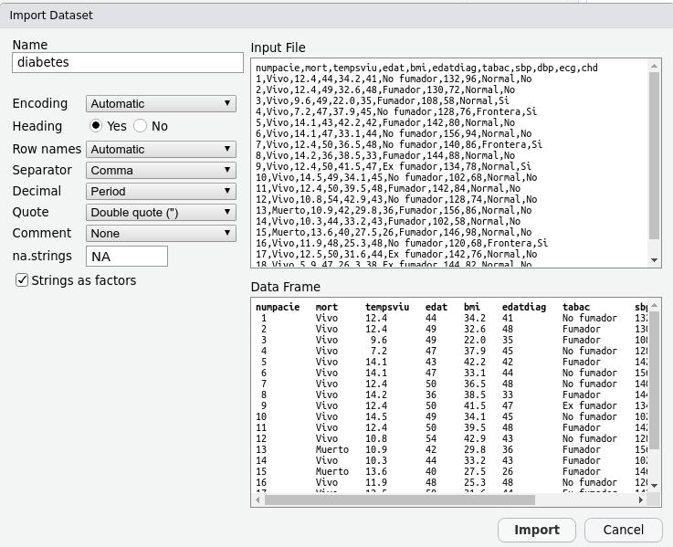

```{r  include=FALSE}
require(knitr)
opts_chunk$set(
concordance=FALSE, echo=TRUE, cache=FALSE, warning=FALSE, error=FALSE, message=TRUE, fig.height=4, size = "footnotesize")

def.chunk.hook  <- knitr::knit_hooks$get("chunk")
knitr::knit_hooks$set(chunk = function(x, options) {
  x <- def.chunk.hook(x, options)
  ifelse(options$size != "normalsize", paste0("\\", options$size,"\n\n", x, "\n\n \\normalsize"), x)
})
```

```{r setLicense, child = 'license.Rmd', eval =F}
```

## Outline: Exploratory Analysis with R

```{=tex}
\begin{itemize}
  \item Descriptive Statistics
  \begin{itemize}
    \item Numerical summaries
    \item Graphical exploration
  \end{itemize}
\end{itemize}
```
\vspace{1cm}

\tiny *Based on this Course:\* [*BIMS 8382, University of Virginia School of Medicine (USA)*] (<https://bioconnector.github.io/workshops/index.html>).

## What packages we will use today?

Please be sure you have the following packages installed:

-   **dplyr** - subletting, sorting, transforming variables, grouping
-   **ggplot2** - system for creating graphics
-   **readxl** - reading .xls files

```{r, message=FALSE}
# install.packages("dplyr", dependencies = TRUE)
# install.packages("ggplot2", dependencies = TRUE)
# install.packages("readxl", dependencies = TRUE)

library(dplyr)
library(ggplot2)
library(readxl)
```

## The Data Science Approach in R

```{=tex}
\begin{figure}
  \includegraphics[width=.9\linewidth]{images/data-science.png}
\end{figure}
```
# Getting started

## Getting started (I)

1.  Load the dataset \emph{diabetes}:

```{r, size="footnotesize", message=FALSE}
diab <- read_excel("datasets/diabetes_mod.xls")
```

2.  Check if we have loaded it correctly:

```{r, size="tiny"}
diab[1:4, 1:8]
```

## Getting started (II): functions to check a dataframe:

-  Content

    - `head`(): shows the first few rows 
    - `tail`(): shows the last few rows

-  Size

    - `dim`(): returns the number of rows and the number of columns 
    - `nrow`(): returns the number of rows 
    - `ncol`(): returns the number of columns

-  Summary

    - `colnames`() or names(): returns the column names 
    - `glimpse`(): returns a glimpse of your data: structure, class, length and content of each column

## Getting started (III)

```{r size="tiny"}
head(diab)
```

## Getting started (IV)

```{r}
dim(diab)
nrow(diab)
colnames(diab)
```

## Getting started (IV)

```{r size="tiny"}
glimpse(diab)
```

## Variables and data types

-   Data managed in R is stored as *variables*

-   Variables can be of distinct types:

    -   Numerical

        -   numeric (13.7)
        -   int (3)

    -   Character

        -   "R is cute"

    -   Factors

        -   A,B,C,D
        -   WT, Mut

    -   Logical

        -   TRUE/FALSE

## Exercise I

-   Load the `osteoporosis` dataset

-   Proceed similarly as to what we have done above and obtain information on

    -  How many variables and observations
    -  How are them (What are their types)

## More about factors

-   Each data type is what it seems to be, but factors require more explanation.

-   Factors are intended to describe categories such as "sex", "blood group", but also "risk" or "stage".

-   Factors are useful to describe groups without having to use numeric codes.

-   Factors may be created while reading the file or later using the `factor` and `as.factor` commands.

## Create factor while reading

-   Import the diabetes dataset from the `diabetes.csv` file using the Rstudio dialog.

    

## Check variable type

```{r}
diabetes <- read.csv("datasets/diabetes.csv", stringsAsFactors=TRUE)
class(diabetes$mort)
sapply(diabetes, class)
```

Repeat

- Re-read the file from excel or without setting the "stringsAsFactors" to TRUE


## Creating factors directly

- Use `factor` or `as.factor`

```{r}
diabetes <- read.csv("datasets/diabetes.csv", stringsAsFactors=FALSE)
class(diabetes$mort)
diabetes$mort <- as.factor(diabetes$mort)
class(diabetes$mort)
levels(diabetes$mort)
```

Warning! by default alphabetic order is used when creating factor levels.

```{r}
vitalStatus <- factor(diabetes$mort, levels=c("Vivo", "Muerto"))
class(vitalStatus)
levels(vitalStatus)
```

## Change the levels of a factor

- When humans fill the database... many errors can happen :(

  - An answer like "YES", could be entered like: 
    
          "YES", "yes", "Yes", "Yeah "

- All this possible answers **will become differents levels for the same factor variable**

- This may be solved using `recode_factor`:

```{r}
diab$mort <- recode_factor(diab$mort, "Muerto" = "muerto")
levels(diab$mort)
```


## Changing *characters (chr)* to *factors (Factor)*

An alternative way to turn characters into factors is the  `mutate_if` function:

```{r size="tiny"}
library(dplyr)
diab <- diabetes %>% mutate_if(is.character, as.factor)
glimpse(diab)
```

# Exploratory Data Analysis: Numerical summaries

## Numerical Summaries (I)

- There are many functions to provide numerical summaries

```{r size="tiny"}
#Mean, median and rang
mean(diab$edat)
median(diab$edat)
sd(diab$edat)
var(diab$edat)
range(diab$edat)
```

## Numerical Summaries (II)

A general summary of all variables is provided by distinct functions

```{r size="tiny"}
summary(diab[, 2:11])
```

## Improving the `summary` function

- There are many packages to do descriptive statistics.

- See [Dabbling with data](https://dabblingwithdata.wordpress.com/2018/01/02/my-favourite-r-package-for-summarising-data/)

- Give a try, for instance to the `skimr` or `summarytools` packages.

## More complete descriptions (I)

```{r, size="tiny", message=FALSE}
library(summarytools)
dfSummary(diabetes)
```


## Grouped summeries

If we want to group the descriptive summaries by other variables we can use `group_by` function:

```{r size="tiny"}
diab %>% 
  group_by(tabac, ecg) %>%
  summarize(mean(edat))
```

## Handling missing data

- What happens if we have missing data in our dataset?

- The file `diabetes_mod.xls` contains some missings

```{r size="tiny"}
diabetes_mod <- read_excel("datasets/diabetes_mod.xls")
diab <- diabetes_mod %>% mutate_if(is.character, as.factor)
mean(diab$sbp)
```

**NA** indicates *missing data* in the variable

Let's look the `sbp` variable:

```{r size="tiny"}
diab$sbp
```

## Numerical Summaries (VII)

How to work with *missing data*:

```{r size="tiny"}
?mean
mean(diab$sbp, na.rm = TRUE)
is.na(diab$sbp)
```

## Numerical Summaries (VIII)

How to work with *missing data*:

```{r}
sum(is.na(diab$sbp))
sum(is.na(diab$dbp))
diab_noNAS <-na.omit(diab)  
dim(diab)
dim(diab_noNAS)
```

See also: [Remove Rows with NA in R Data Frame](https://statisticsglobe.com/r-remove-data-frame-rows-with-some-or-all-na)

## EXERCISE

1.  With the `diab` dataset

-   Show only the rows from 35 to 98 and columns 5, 7, and from 9 to 11

-   Change the level of the variable *tabac*, from **No Fumador** to **No\_Fumador**

-   Display the unique values for the variable *bmi*. Count how many exist.

-   Display the mean of *edatdiag*, grouped by *ecg*


# Exploratory Data Analysis (EDA): Graphical summaries

- We could dedicate one whole course to Data Visualization (at least see our "Statistical Pill on Data Visualization")

- Here we will only see the most common approaches to visualize data:

    - Histograms
    - Barplots
    - Piecharts
    - Boxplots
    - Scatterplots

## R graphics engines

- R is very powerful and flexible at doing graphics.

- This comes at a price: Complex graphics (that we do not show here) may require sonme extra effort.

- Much work has been done to simplify this

  + There exist graphical tools that allow for the interactive construction of plots.
  
  + There exist new approaches to plotting that try to be more intuitive than "traditional" ones.

- `ggplot` is one of such approaches.

## Histograms

- We will use histograms to plot the frequencies of each range of values in continuous variables.

- These plots provide an approximation to the distribution of the variables being represented.


```{r}
hist(diab$edat)
```

## A histogram in `ggplot`

- Every ggplot has, at least, three components

  + The data used 
  + The variables that go in each axis (the "aesthetics")
  + The type of plot
- Plots are built progressively "adding layers"

---

```{r}
library(ggplot2)
ggplot(data=diab, aes(x=edat))+
  geom_histogram()
```


## Improving plots with graphic parameters

- Plots can be improved using _graphical parameters_

- Some parameters are the same in all graphs. Others are specific of one or other graph.

```{r}
hist(diab$edat, main="Age at diagnostic", probability = TRUE, xlab="Age", ylab="Percentage")
```

## Improving plots in ggplots

- Plots can be improved using _graphical parameters_

- Some parameters are the same in all graphs. Others are specific of one or other graph.

---

```{r}
ggplot(data=diab, aes(x=edat))+
  geom_histogram(aes(y=..density..))+
  ggtitle("Age at diagnostic")+
  xlab("Age") + ylab("Percentage")
```


## Boxplot. A one-dimensional histogram

```{r}
boxplot (diab$edat, main ="Age")
```

## Boxplot: Decomposing plots by groups

```{r}
boxplot(edat~tabac, data=diab, 
        main="Age at diagnostic according smoking status")
```


## Plots for categorical variables

- Some simple principles

  + Use pie charts only with categorical variables in nominal scale
  + Use barplots for any categorical variable
  + Never use 3D-plots

```{r}
t <- table(diab$mort)
pie(t)
```

## Barplots

- Similar to pie charts but, implicitly, suggest ordering

```{r}
barplot(t)
```

## Scatterplots

- For two variables, simply use `plot`

```{r}
plot(edat~bmi, data=diab)
```


## EXERCISE

- With the `diab` dataset

  -  Use the best graphic type to plot the relation between *sbp* and *dbp*

  - Show graphically the relation between *edat* and *ecg*

  - Plot the *sbp* frequencies


## EXERCISE

- Using the *osteoporosis.csv* dataset

 - Load the dataset and check if it is correctly loaded
 - Calculate the mean and standard deviation of imc grouped by clasific
 - Plot the distribution of edat

