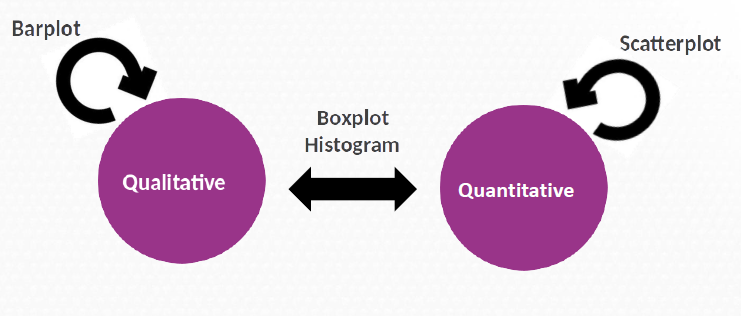
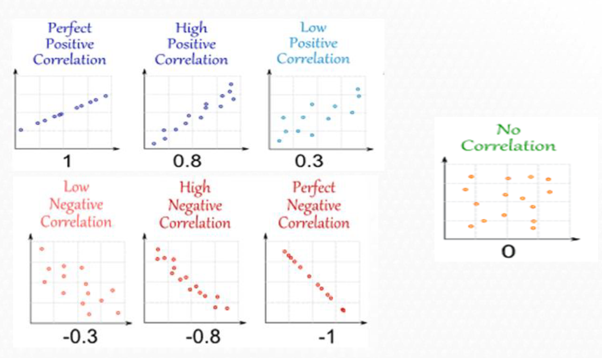

```{r, echo = FALSE, results = 'hide', message = F}
require(knitr)
# include this code chunk as-is to set options
opts_chunk$set(fig.width = 7, fig.height = 3, warning = F)

```


# Elegant graphics for data analysis

- R is a powerful tool to plot your data
- Hadley Wickham introduced (2009) **ggplot2**, a grammar of graphics
- Extensions:
  - `GGally`, `ggrepel` .. 
- References:
  - [ggplot2 book](https://ggplot2-book.org/)
  - [STHDA. Statistical tools for high throughput data analysis](http://www.sthda.com/english/wiki/ggplot2-essentials)
  - [R Colors](http://www.stat.columbia.edu/~tzheng/files/Rcolor.pdf)
  
## How ggplot2 works?

- Based on the Grammar of Graphics (Wilkinson 2005)
- A graphic maps data to aesthetic attributes of geometric objects
- May include statistical transformations and coordinate system

## Components of ggplot2

- Layer: geoms, stats
- Scales: aesthetics like color, shapes, legend
- Coord: axes, gridlines
- Facet: to divide data into multiple plots
- Theme: font size, background colors

## Installation

```{r, eval=FALSE}
# install.packages("pacman")
library(pacman)
p_load(ggplot2)
```


## Load diabetes database

```{r, eval=TRUE}
library(pacman)
p_load(rio)
osteo <- rio::import("datasets/osteoporosis.csv", dec = ",")

```

## First steps 

Three key components

-  Data

-  Aesthetic mappings between variables

- A least one layer Usually created with a geom function


## Basic Structure. Points


```{r}
library(ggplot2)
ggplot(osteo, aes(x = edad , y = bua )) + 
  geom_point()
```


## Basic Structure. Points + color

```{r}
ggplot(osteo, aes(x = edad , y = bua   , color = menop)) + 
  geom_point()
```


## Basic Structure. Points + color  + shape

```{r}
ggplot(osteo, aes(x = edad , y = bua   , color = menop, shape = clasific )) + 
  geom_point()
```

# From Univariate to Bivariate Analysis

- Univariate: analysis of one variable
- Bivariate: check for relationships between two variables


## Questions to consider

If there are more than one variable in the dataset it could be interesting
to guess if:


- Does a relation exist?
- How important is it?
- What is the direction?

# Bivariate Analysis

## Types 

Some plots to study the relationship between two variables...



## Definition

- Bivariate analysis explores the relationship between two variables.
- The approach depends on whether the variables are numerical or categorical.


## Qualitative vs Qualitative

- Use contingency tables
- Chi-squared test for independence

### Example data

```{r}
library(rio)
library(gmodels)

CrossTable(osteo$grupedad, osteo$clasific, prop.c = FALSE, prop.r = FALSE, prop.chisq = FALSE)
```

## Barplots

- We can use bar plots to explore the relationship.
- Example: **grupedad vs clasific**

```{r}
ggplot(osteo, aes(x = grupedad, fill = clasific)) + 
  geom_bar()
```

```{r}
ggplot(osteo, aes(x = grupedad, fill = clasific)) + 
  geom_bar(position = "dodge")
```

## Customizing

```{r}
p <- ggplot(osteo, aes(x = grupedad, fill = clasific)) +
  geom_bar(position = "dodge") +
  scale_fill_manual(values=c("#8618b1", "blanchedalmond", "red")) +
  theme(legend.position="bottom") +
  labs(x = "Age group", y = "Women", title = "Osteo disease classified by age group")
p
```


## Qualitative vs Quantitative

- One qualitative and one quantitative variable
- Use table of means or boxplots

```{r}
library(dplyr)
osteo %>%
  group_by(grupedad) %>%
  summarize(mean_bua = mean(bua, na.rm = TRUE))
```

## Boxplots


```{r}
bp <- ggplot(osteo, aes(x = grupedad, y = bua)) + 
  geom_boxplot(fill = '#A4A4A4', color = "purple")
bp
```

## Customizing

```{r}
bp + geom_jitter(shape = 16, position = position_jitter(0.2)) +
  labs(x = "Age Group", y = "Women", title = "Osteo disease classified by age group")
```


## Quantitative vs Quantitative


- Scatter plots are useful to show correlation or pattern.
- Example: **edad vs bua**

### Example data

```{r}
head(osteo[, c("peso", "imc")], n = 10)
```


## Scatterplot
```{r}
ggplot(osteo, aes(x = peso, y = imc)) + 
  geom_point()
```

## Customizing

```{r}
ggplot(osteo, aes(x = peso, y = imc)) +
  geom_point(size = 1, shape = 1)
```


## Add information

```{r}
ggplot(osteo, aes(x = peso, y = imc, color = clasific, shape = clasific)) +
  geom_point()
```

## Other relation 

But not always the correlation is good!

```{r}
ggplot(osteo, aes(x = edad, y = imc)) +
  geom_point()
```


## Multiple plots

```{r}
library(GGally)
ggpairs(osteo, columns = c("edad", "peso", "talla", "imc", "bua", "menarqui"), 
        ggplot2::aes(colour = clasific))
```

# Exercise I 


Load the `diabetes` dataset

Study relation between `mort` and `tabac`

  - **Build a contingency table between `mort` and `tabac`.**
  
  

  - **Visualize the relationship between `mort` and `tabac`.**

Study relation between `mort` and `bmi`

  - **Calculate Mean, median, and standard deviation of bmi by categories of mort.**

  - **Visualze the  relationship between `bmi` by `mort` status**


Study relation between `bmi` and `edad`

  - **Visualze the  relationship between age and BMI.**


Is there a relationship between the variables?


# Correlation


## Main characteristics

Correlation analysis allows

- To study the way of relation between the two variables

-  To quantify the intensity of relation

Correlation is not causation one thing does not causes the other

In the correlation analysis, the two variables have the same weight

The correlation coefficient measures the strength of a linear relation


## Concepts

- Correlation quantifies strength and direction of relationship
- r from -1 to 1
  - r > 0: direct
  - r < 0: inverse
  - r = 0: no relation
  
## Types correlation. Pearson



## Pearson

```{r}
cor(osteo$bua, osteo$edad, method = "pearson")
```

Don’t forget to look the graphic!!

```{r}
ggplot(osteo, aes(x = edad, y = bua)) + 
  geom_point()
```

## Spearman


- Pearson correlation coefficient is severely affected by outliers and if the relation is not linear

 -->  Better to use Spearman correlation coefficient (use the ranks between the numbers instead the values) to calculate the correlation coefficient

- Evaluates the monotonic relationship between the variables (not the linear relationship as Pearson does).


-->The variables tend to change together but not necessarily at a constant rate


## Types of correlation


## Example

```{r}
cor(osteo$bua, osteo$edad, method = "spearman")
```

## Correlation Matrix

```{r}
cor(osteo[, c("edad", "peso", "talla", "imc", "bua", "menarqui")], use = "complete.obs")
```


# Summary

- Use `geom_bar` for categorical-categorical
- Use `geom_boxplot` for categorical-numerical
- Use `geom_point` for numerical-numerical
- Always include clear labels and titles


# Exercises

- **Calculate Pearson and Spearman correlations between `edat` and `bmi`.**

- **Calculate the correlation between all pairs of numerical variables.**

- **Use the GGally package to visualize all pairwise relationships between variables using the ggpairs() function.**


# Extra

# Interactive and Impressive Plots
```{r}
p_load(janitor)
diab <- import("datasets/diabetes.sav")
diab<- clean_names(diab)
```

## Interactive Scatter Plot with Tooltips

```{r, message=FALSE, warning=FALSE}
p_load(plotly)

p1 <- ggplot(diab, aes(x = edat, y = bmi, color = tabac, label = chd)) +
  geom_point(size = 3) +
  labs(title = "BMI vs Age (colored by Smoking)", x = "Age", y = "BMI")

# ggplotly(p1, tooltip = c("x", "y", "label", "color"))
```

## Violin Plot for BMI by Smoking Status

```{r}
ggplot(diab, aes(x = tabac, y = bmi, fill = tabac)) +
  geom_violin(trim = FALSE, color = "black") +
  geom_jitter(width = 0.2, alpha = 0.6) +
  labs(title = "Violin Plot: BMI by Smoking Status", x = "Smoking", y = "BMI") +
  theme_minimal()
```

## Density Plot by CHD Status

```{r}
ggplot(diab, aes(x = bmi, fill = chd)) +
  geom_density(alpha = 0.5) +
  labs(title = "BMI Distribution by CHD", x = "BMI", y = "Density") +
  theme_classic()
```

## Boxplot + Points + Mean Line

```{r}
ggplot(diab, aes(x = tabac, y = bmi, fill = tabac)) +
  geom_boxplot(outlier.shape = NA) +
  geom_jitter(width = 0.15, color = "black", size = 2, alpha = 0.7) +
  stat_summary(fun = mean, geom = "point", shape = 20, size = 5, color = "red") +
  labs(title = "BMI by Smoking Status with Mean", x = "Smoking", y = "BMI") +
  theme_light()
```


# Geospatial Visualization

## World Map with Countries Colored

```{r, message=FALSE, warning=FALSE}
p_load(maps)

# Load world map data
world <- map_data("world")

# Plot a basic world map
ggplot(world, aes(x = long, y = lat, group = group)) +
  geom_polygon(fill = "lightblue", color = "white") +
  labs(title = "Basic World Map") +
  theme_minimal()
```


# Summary

- Use `plotly` for interactive visualizations
- `GGally::ggpairs` offers compact overviews
- Combine multiple `ggplot2` layers for clarity and emphasis

