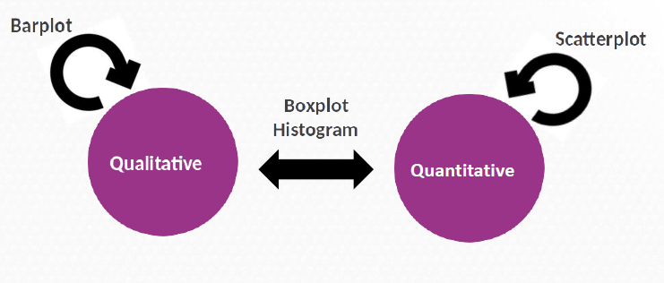
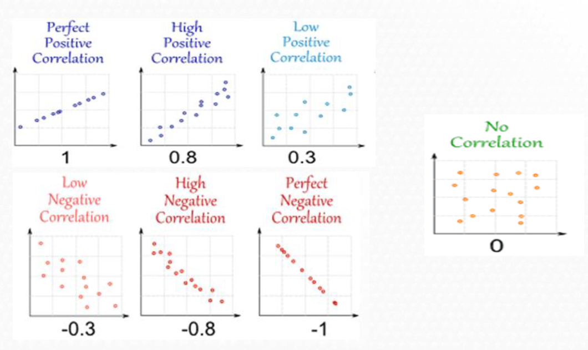
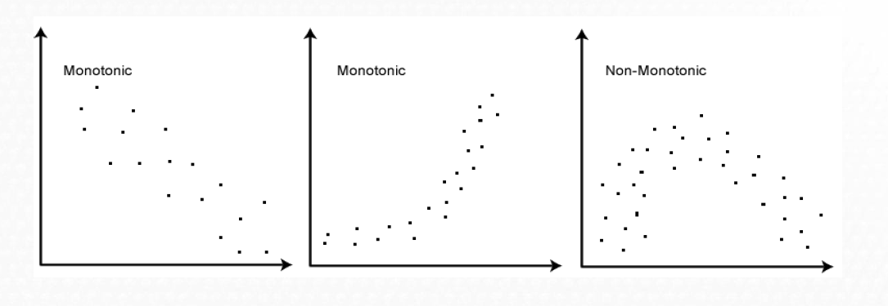
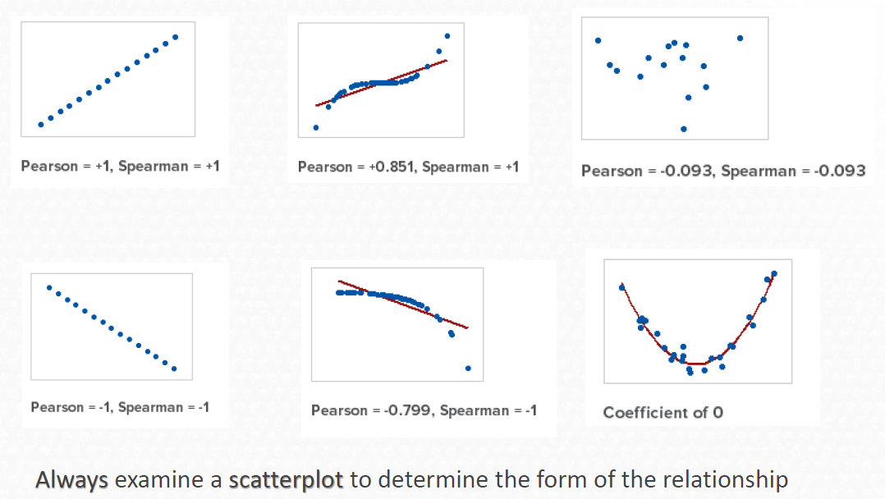

# Outline

- Elegant graphics for data analysis

- From univariate to bivariate analysis

- Bivariate analysis
  
    - Qualitative vs Qualitative
    
    - Qualitative vs Quantitative
    
    - Quantitative vs Quantitative
    
- Correlation

    - Definition
    
    - Types of correlation (Pearson, Spearman)
    
- Extra


# Outline

- **Elegant graphics for data analysis**

- From univariate to bivariate analysis

- Bivariate analysis
  
    - Qualitative vs Qualitative
    
    - Qualitative vs Quantitative
    
    - Quantitative vs Quantitative
    
- Correlation

    - Definition
    
    - Types of correlation (Pearson, Spearman)
    
- Extra

# Elegant graphics for data analysis

- R is a powerful tool to plot your data
- Hadley Wickham introduced (2009) **ggplot2**, a grammar of graphics
- Extensions:
  - `GGally`, `ggrepel` .. 
- References:
  - [ggplot2 book](https://ggplot2-book.org/)
  - [STHDA. Statistical tools for high throughput data analysis](http://www.sthda.com/english/wiki/ggplot2-essentials)
  - [R Colors](http://www.stat.columbia.edu/~tzheng/files/Rcolor.pdf)
  
## How ggplot2 works?

- Based on the Grammar of Graphics (Wilkinson 2005)
- A graphic maps data to aesthetic attributes of geometric objects
- May include statistical transformations and coordinate system

## Components of ggplot2

- Layer: geoms, stats
- Scales: aesthetics like color, shapes, legend
- Coord: axes, gridlines
- Facet: to divide data into multiple plots
- Theme: font size, background colors

## Installation


``` r
# install.packages("pacman")
library(pacman)
p_load(ggplot2)
```


## Load diabetes database


``` r
library(pacman)
p_load(rio)
osteo <- rio::import("datasets/osteoporosis.csv", dec = ",")
```

## First steps 

Three key components

-  Data

-  Aesthetic mappings between variables

- A least one layer Usually created with a geom function


## Basic Structure. Points


``` r
library(ggplot2)
ggplot(osteo, aes(x = edad , y = bua )) + 
  geom_point()
```

<!-- --> 


## Basic Structure. Points + color


``` r
ggplot(osteo, aes(x = edad , y = bua   , color = menop)) + 
  geom_point()
```

<!-- --> 


## Basic Structure. Points + color  + shape


``` r
ggplot(osteo, aes(x = edad , y = bua   , color = menop, shape = clasific )) + 
  geom_point()
```

<!-- --> 


# From Univariate to Bivariate Analysis

- Elegant graphics for data analysis

- **From univariate to bivariate analysis**

- Bivariate analysis
  
    - Qualitative vs Qualitative
    
    - Qualitative vs Quantitative
    
    - Quantitative vs Quantitative
    
- Correlation

    - Definition
    
    - Types of correlation (Pearson, Spearman)
    
- Extra

# From Univariate to Bivariate Analysis

- Univariate: analysis of one variable
- Bivariate: check for relationships between two variables


## Questions to consider

If there are more than one variable in the dataset it could be interesting
to guess if:


- Does a relation exist?
- How important is it?
- What is the direction?


# Bivariate Analysis

- Elegant graphics for data analysis

- From univariate to bivariate analysis

- **Bivariate analysis**
  
    - **Qualitative vs Qualitative**
    
    - **Qualitative vs Quantitative**
    
    - **Quantitative vs Quantitative**
    
- Correlation

    - Definition
    
    - Types of correlation (Pearson, Spearman)
    
- Extra

# Bivariate Analysis

## Types 

Some plots to study the relationship between two variables...



## Definition

- Bivariate analysis explores the relationship between two variables.
- The approach depends on whether the variables are numerical or categorical.


## Qualitative vs Qualitative

- Use contingency tables
- Chi-squared test for independence

### Example data


``` r
library(rio)
library(gmodels)

CrossTable(osteo$grupedad, osteo$clasific, prop.c = FALSE, prop.r = FALSE, prop.chisq = FALSE)
```

```
## 
##  
##    Cell Contents
## |-------------------------|
## |                       N |
## |         N / Table Total |
## |-------------------------|
## 
##  
## Total Observations in Table:  1000 
## 
##  
##                | osteo$clasific 
## osteo$grupedad |       NORMAL |   OSTEOPENIA | OSTEOPOROSIS |    Row Total | 
## ---------------|--------------|--------------|--------------|--------------|
##        45 - 49 |          233 |          138 |            7 |          378 | 
##                |        0.233 |        0.138 |        0.007 |              | 
## ---------------|--------------|--------------|--------------|--------------|
##        50 - 54 |          113 |          113 |            7 |          233 | 
##                |        0.113 |        0.113 |        0.007 |              | 
## ---------------|--------------|--------------|--------------|--------------|
##        55 - 59 |           67 |          100 |            9 |          176 | 
##                |        0.067 |        0.100 |        0.009 |              | 
## ---------------|--------------|--------------|--------------|--------------|
##        60 - 64 |           38 |           74 |           17 |          129 | 
##                |        0.038 |        0.074 |        0.017 |              | 
## ---------------|--------------|--------------|--------------|--------------|
##        65 - 69 |           18 |           42 |           24 |           84 | 
##                |        0.018 |        0.042 |        0.024 |              | 
## ---------------|--------------|--------------|--------------|--------------|
##   Column Total |          469 |          467 |           64 |         1000 | 
## ---------------|--------------|--------------|--------------|--------------|
## 
## 
```

## Barplots

- We can use bar plots to explore the relationship.
- Example: **grupedad vs clasific**


``` r
ggplot(osteo, aes(x = grupedad, fill = clasific)) + 
  geom_bar()
```

<!-- --> 


``` r
ggplot(osteo, aes(x = grupedad, fill = clasific)) + 
  geom_bar(position = "dodge")
```

<!-- --> 

## Customizing


``` r
p <- ggplot(osteo, aes(x = grupedad, fill = clasific)) +
  geom_bar(position = "dodge") +
  scale_fill_manual(values=c("#8618b1", "blanchedalmond", "red")) +
  theme(legend.position="bottom") +
  labs(x = "Age group", y = "Women", title = "Osteo disease classified by age group")
p
```

<!-- --> 


## Qualitative vs Quantitative

- One qualitative and one quantitative variable
- Use table of means or boxplots


``` r
library(dplyr)
```

```
## 
## Adjuntando el paquete: 'dplyr'
```

```
## The following objects are masked from 'package:stats':
## 
##     filter, lag
```

```
## The following objects are masked from 'package:base':
## 
##     intersect, setdiff, setequal, union
```

``` r
osteo %>%
  group_by(grupedad) %>%
  summarize(mean_bua = mean(bua, na.rm = TRUE))
```

```
## # A tibble: 5 x 2
##   grupedad mean_bua
##   <chr>       <dbl>
## 1 45 - 49      78.8
## 2 50 - 54      75.1
## 3 55 - 59      71.4
## 4 60 - 64      64.9
## 5 65 - 69      60.7
```

## Boxplots


``` r
bp <- ggplot(osteo, aes(x = grupedad, y = bua)) + 
  geom_boxplot(fill = '#A4A4A4', color = "purple")
bp
```

<!-- --> 

## Customizing


``` r
bp + geom_jitter(shape = 16, position = position_jitter(0.2)) +
  labs(x = "Age Group", y = "Women", title = "Osteo disease classified by age group")
```

<!-- --> 


## Quantitative vs Quantitative


- Scatter plots are useful to show correlation or pattern.
- Example: **edad vs bua**

### Example data


``` r
head(osteo[, c("peso", "imc")], n = 10)
```

```
##    peso   imc
## 1  70.0 24.80
## 2  53.0 22.94
## 3  64.0 25.64
## 4  78.0 30.09
## 5  56.0 22.72
## 6  63.5 21.97
## 7  86.0 33.18
## 8  61.5 22.87
## 9  60.5 24.23
## 10 64.0 28.83
```


## Scatterplot

``` r
ggplot(osteo, aes(x = peso, y = imc)) + 
  geom_point()
```

<!-- --> 

## Customizing


``` r
ggplot(osteo, aes(x = peso, y = imc)) +
  geom_point(size = 1, shape = 1)
```

<!-- --> 


## Add information


``` r
ggplot(osteo, aes(x = peso, y = imc, color = clasific, shape = clasific)) +
  geom_point()
```

<!-- --> 

## Other relation 

But not always the correlation is good!


``` r
ggplot(osteo, aes(x = edad, y = imc)) +
  geom_point()
```

<!-- --> 


## Multiple plots


``` r
library(GGally)
```

```
## Registered S3 method overwritten by 'GGally':
##   method from   
##   +.gg   ggplot2
```

``` r
ggpairs(osteo, columns = c("edad", "peso", "talla", "imc", "bua", "menarqui"), 
        ggplot2::aes(colour = clasific))
```

<!-- --> 

# Exercise I 


Load the `diabetes` dataset


``` r
p_load(janitor)
  diab <- import("datasets/diabetes_mod.xls")
diab<- clean_names(diab)
```

Study relation between `mort` and `tabac`

  - **Build a contingency table between `mort` and `tabac`.**
  
  

  - **Visualize the relationship between `mort` and `tabac`.**

Study relation between `mort` and `bmi`

  - **Calculate Mean, median, and standard deviation of bmi by categories of mort.**

  - **Visualze the  relationship between `bmi` by `mort` status**


Study relation between `bmi` and `edad`

  - **Visualze the  relationship between age and BMI.**


Is there a relationship between the variables?


# Correlation

- Elegant graphics for data analysis

- From univariate to bivariate analysis

- Bivariate analysis
  
    - Qualitative vs Qualitative
    
    - Qualitative vs Quantitative
    
    - Quantitative vs Quantitative
    
- **Correlation**

    - **Definition**
    
    - **Types of correlation (Pearson, Spearman)**
    
- Extra

# Correlation


## Main characteristics

Correlation analysis allows

- To study the way of relation between the two variables

-  To quantify the intensity of relation

Correlation is not causation one thing does not causes the other

In the correlation analysis, the two variables have the same weight

The correlation coefficient measures the strength of a linear relation


## Concepts

- Correlation quantifies strength and direction of relationship
- r from -1 to 1
  - r > 0: direct
  - r < 0: inverse
  - r = 0: no relation
  
## Types correlation. Pearson



## Pearson


``` r
cor(osteo$bua, osteo$edad, method = "pearson")
```

```
## [1] -0.3601883
```

Don’t forget to look the graphic!!


``` r
ggplot(osteo, aes(x = edad, y = bua)) + 
  geom_point()
```

<!-- --> 

## Spearman


- Pearson correlation coefficient is severely affected by outliers and if the relation is not linear

 -->  Better to use Spearman correlation coefficient (use the ranks between the numbers instead the values) to calculate the correlation coefficient

- Evaluates the monotonic relationship between the variables (not the linear relationship as Pearson does).


-->The variables tend to change together but not necessarily at a constant rate



## Types of correlation



## Example


``` r
cor(osteo$bua, osteo$edad, method = "spearman")
```

```
## [1] -0.3540295
```

## Correlation Matrix


``` r
cor(osteo[, c("edad", "peso", "talla", "imc", "bua", "menarqui")], use = "complete.obs")
```

```
##                edad         peso       talla         imc         bua
## edad      1.0000000  0.182629245 -0.16635268  0.26173285 -0.36018834
## peso      0.1826292  1.000000000  0.23110585  0.89278635  0.09467837
## talla    -0.1663527  0.231105848  1.00000000 -0.22546438  0.13350207
## imc       0.2617329  0.892786346 -0.22546438  1.00000000  0.03415938
## bua      -0.3601883  0.094678365  0.13350207  0.03415938  1.00000000
## menarqui  0.1159013 -0.008526465  0.07000284 -0.04160766 -0.08593554
##              menarqui
## edad      0.115901253
## peso     -0.008526465
## talla     0.070002843
## imc      -0.041607661
## bua      -0.085935539
## menarqui  1.000000000
```


# Summary

- Use `geom_bar` for categorical-categorical
- Use `geom_boxplot` for categorical-numerical
- Use `geom_point` for numerical-numerical
- Always include clear labels and titles


# Exercises II

- **Calculate Pearson and Spearman correlations between `edat` and `bmi`.**


**Scatter plot of `edat` vs `bmi` colored by CHD status.**


- **Calculate the correlation between all pairs of numerical variables.**


- **Use the GGally package to visualize all pairwise relationships between variables using the ggpairs() function.**


# Extra

- Elegant graphics for data analysis

- From univariate to bivariate analysis

- Bivariate analysis
  
    - Qualitative vs Qualitative
    
    - Qualitative vs Quantitative
    
    - Quantitative vs Quantitative
    
- Correlation

    - Definition
    
    - Types of correlation (Pearson, Spearman)
    
- **Extra**

# Extra

# Interactive and Impressive Plots


## Interactive Scatter Plot with Tooltips


``` r
p_load(plotly)

p1 <- ggplot(diab, aes(x = edat, y = bmi, color = tabac, label = chd)) +
  geom_point(size = 3) +
  labs(title = "BMI vs Age (colored by Smoking)", x = "Age", y = "BMI")

# ggplotly(p1, tooltip = c("x", "y", "label", "color"))
```

## Violin Plot for BMI by Smoking Status


``` r
ggplot(diab, aes(x = tabac, y = bmi, fill = tabac)) +
  geom_violin(trim = FALSE, color = "black") +
  geom_jitter(width = 0.2, alpha = 0.6) +
  labs(title = "Violin Plot: BMI by Smoking Status", x = "Smoking", y = "BMI") +
  theme_minimal()
```

<!-- --> 

## Density Plot by CHD Status


``` r
ggplot(diab, aes(x = bmi, fill = chd)) +
  geom_density(alpha = 0.5) +
  labs(title = "BMI Distribution by CHD", x = "BMI", y = "Density") +
  theme_classic()
```

<!-- --> 

## Boxplot + Points + Mean Line


``` r
ggplot(diab, aes(x = tabac, y = bmi, fill = tabac)) +
  geom_boxplot(outlier.shape = NA) +
  geom_jitter(width = 0.15, color = "black", size = 2, alpha = 0.7) +
  stat_summary(fun = mean, geom = "point", shape = 20, size = 5, color = "red") +
  labs(title = "BMI by Smoking Status with Mean", x = "Smoking", y = "BMI") +
  theme_light()
```

<!-- --> 


# Geospatial Visualization

## World Map with Countries Colored


``` r
p_load(maps)

# Load world map data
world <- map_data("world")

# Plot a basic world map
ggplot(world, aes(x = long, y = lat, group = group)) +
  geom_polygon(fill = "lightblue", color = "white") +
  labs(title = "Basic World Map") +
  theme_minimal()
```

<!-- --> 


# Summary

- Use `plotly` for interactive visualizations
- `GGally::ggpairs` offers compact overviews
- Combine multiple `ggplot2` layers for clarity and emphasis

