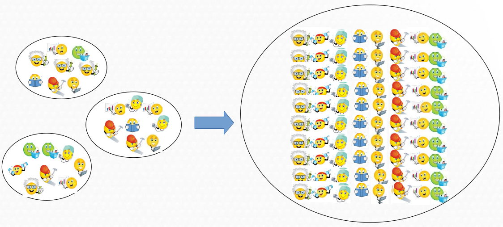
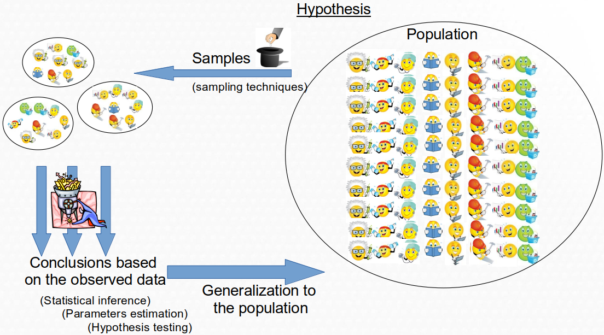

```{r setLicense, child = 'license.Rmd'}
```

# Outline

- The objectives of statistical inference
- Examples
- Point estimation. On incidence and prevalence
- Confidence intervals
- Sample size calculations

# The objectives of Statistical Inference (I)

Taking the observed (measured) values of a group of samples...

```{r, echo=FALSE, out.width="80%", fig.cap=""}

```
we aim at determining the properties of the entire population.

# The objectives of Statistical Inference (II)

```{r, echo=FALSE, out.width="80%", fig.cap=""}

```

# Example
- Consider the data in the "osteoporosis.csv" dataset.
- It can be useful to provide information such as:
    - The percentage of menopausic women with osteoporosis 
    - The mean bone density in menopausic or non-menopausic women
    - The existence of significance differences:
        - Observed % of osteoporosis vs "theoretical" population values
        - BUA in menopasuic vs non menopausic
- Answering these questions (and questions like these) is the main goal of Statistical Inference

# Two types of statistical inference problems

- ESTIMATION

    - When we wish to _learn some characteristics of our population_, such as
        - The percentage of non osteopenic or menopausic women 
        - The mean bone density in each of these groups
        
- HYPOTHESIS TESING

    - When we wish to _check about some statement on some characteristic of the population_ or we
_wish to make some comparisons_
        - Is it true that the mean bone density is smaller than 75 in menopausic 
        - Can we state that non menopausic women have a higher bone density than menopausic?


# Estimators: Aproximating the value of population parameters

- Numerical values calculated on a sample that we believe to be a good approximation of a certain real value (parameter) in the population.

- Intuitively, we work with many estimators, such as the mean or a computed percentage of a given sample, that we assume that are somehow characterizing a population.

- It is __not always obvious to decide which is the best estimator for each parameter__

- In order to decide which estimator we use we can rely on the _properties_ of the estimators such as __the bias__ or the __precision (the variance)__ of the estimator.

# Exercise

- Read the diabetes dataset. Convert characters into factors before continuing.
- Provide an estimate of 
    - The distribution of a numerical variable.
    - a proportion of at least one categorical variable and 
    - the mean value of at least one numerical variable.
- Could you have used different estimators?
- How would you decide?

# How precise is an estimator?

- We all are familar with "forks" associated with voting results. 
    - They usually start "wide" and tend to disappear as more votes are counted.
- Imagine you are given an estimate of 18% for the incidence of a certain disease.
- Is it a good estimate?
- Hard to know without more information
    - $18 \pm 2%$ is probably useful
    - $18 \pm 12%$ is probably too wide to be considered useful

- So given an estimator and a n estimation (a value) __how can we provide a measure of how precise this estimation is__?

# The _Standard Error_ of an estimator

- An obvious question when we choose an estimator is _how precise it is to approximate the value of the population parameter_.

- This can be answered using the __standard error of the estimator__

- The standard error is a great quantity :
    - It informs about the _precision_ of our estimates
    - Helps build another type of estimators: _confidence intervals_
    - Helps find formulae to compute _sample size_ for estimation

# Some standard errors

- Standard error of the sample mean 
$$
SEM = \frac{\hat s}{\sqrt{n}}
$$
- Standard error of the sample proportion
$$
SEP = \sqrt{\frac{\hat p (1-\hat p)}{n}}
$$

# Confidence intervals

- Confidence intervals are based on standard errors

- Confidence interval for the mean

$$
\overline{X} - t_{\epsilon/2} \frac{\hat s}{\sqrt{n}} \leq \mu \leq
\overline{X} + t_{\epsilon/2} \frac{\hat s}{\sqrt{n}} = 
\mathbf{\overline{X} \pm t_{\epsilon/2} \cdot \mbox{SEM}}
$$

- Confidence interval for the proportion

$$
\hat {p} - z_{\epsilon/2} \sqrt{\frac{\hat p (1-\hat p)}{n}} \leq \mu \leq
\hat {p} + z_{\epsilon/2} \sqrt{\frac{\hat p (1-\hat p)}{n}} = 
\mathbf{\hat {p} \pm z_{\epsilon/2} \cdot \mbox{SEM}}
$$