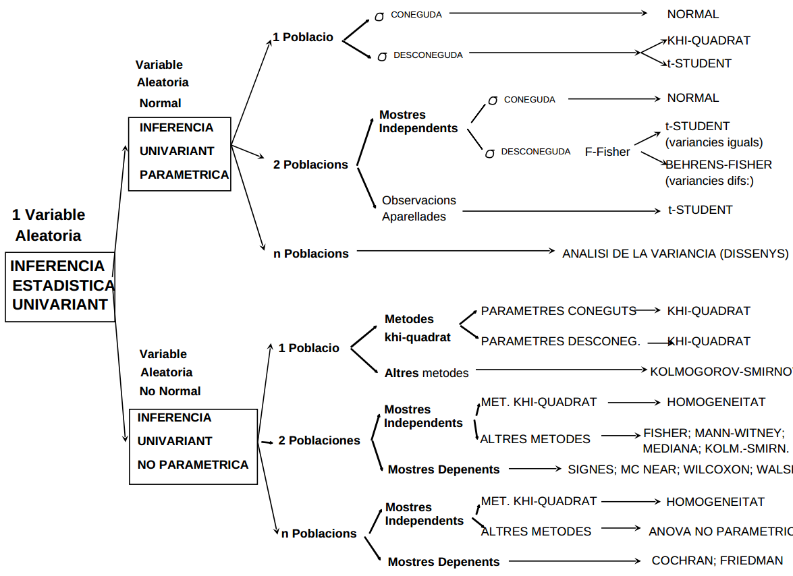
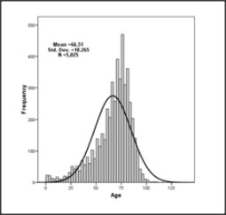

```{r setup, include=FALSE}
knitr::opts_chunk$set(message = FALSE, warning=FALSE)
```

```{r echo=FALSE}
knitr::knit_hooks$set(mysize = function(before, options, envir) {
  if (before) 
    return(options$size)
})
```

# Outline

1. INTRODUCTION
2. TYPE OF TESTS
3. NORMALITY TESTS
4. ONE GROUP COMPARISON
5. TWO GROUPS COMPARISON IN INDEPENDENT SAMPLES
6. TWO GROUPS COMPARISON IN DEPENDENT SAMPLES
7. _K GROUPS COMPARISON IN INDEPENDENT SAMPLES_
8. _Multiple comparisons and multiple testing_

---

# Introduction 

- Once the concept of hypothesis testing is established, 
- Researchers face the problem of _which test should be applied at every possible situation_.
- Best solution: 
  - understand the problem and the questions addressed
  - know available tests for each problem
  - be aware of applicability assumptions of each test and how to check them.
- Easier to say than to do. 
  - Sometimes cheatsheets may be helpful, but be warned against a blind use, that is understand and be critic with the steps. 

# Which test is appropriate for which problem

```{r, echo=FALSE, out.width="80%", out.length="60%", fig.cap=""}

```


# Example situation

- A study was designed to compare two distinct hypertension control programs.
- 60 individuals with HTA were randomly assigned to either one or the other group (30 per group) 
- Blood pressure was measured each month during a year 

```{r loadlibs, echo=FALSE, include=FALSE}
library(dplyr)
library(readxl)
library(magrittr)
library(ggplot2)
```

```{r readExampleData , echo=TRUE, include=FALSE}
hta <- read_excel("datasets/hta.xls")
print(head(hta))
```
---


```{r ,eval=FALSE, mysize=TRUE, size='\\tiny'}

oldpar<-par(mfrow=c(1,1)) # Guarda los parámetros para el dibgujo
par(mfrow=c(2,2)) # Dibuja cuatro gráficos por grafico
with(hta, boxplot(tas1, main="Box-plot") )

with(hta, hist(tas1) )

with(hta, qqnorm(tas1, main="Normal QQplot") );with(hta, qqline(tas1) )

par(oldpar) # Vuelve a los parámetros de dibujo originales

```


```{r, echo=FALSE, out.width="80%", out.length="60%", fig.cap=""}

```


# Normality Test

```{r normtest , mysize=TRUE, size='\\small'}
with(hta,shapiro.test(tad1) ) # Shapiro Wilk test

```


# One sample Test

```{r onetest , mysize=TRUE, size='\\small'}
with(hta,t.test(tad1,mu=90) ) # One sample T.test

```


# Homogeneity variance Test


```{r vartest , mysize=TRUE, size='\\small'}
library(car)
hta%>% 
  group_by(sexo) %>% 
  summarise(var = sd(tas1)) 


with(hta,leveneTest(tad1~factor(sexo),center="median"))

```
  - p value is over 0.05
  - We can assume homogeneity of variances
  
  
  
# T test when variances are equal


```{r eqttest , mysize=TRUE, size='\\small'}
with(hta,t.test(tas1~factor(sexo),var.equal=TRUE ))

```
- Type I Error is over than 0.05
- We cannot reject mean equality


  
# T test when variances are unequal


```{r neqttest , mysize=TRUE, size='\\small'}
with(hta,t.test(tas1~factor(sexo),var.equal=FALSE ))

```
- Same conclusions as before
- Test is also known as Welch test


  
# U Mann-Whitney or Sum Rank non parametric test


```{r umtest , mysize=TRUE, size='\\small'}
with(hta,wilcox.test(tad1~factor(sexo)
    ,alternative='two.sided',exact=TRUE, correct=FALSE))

hta%>% 
  group_by(sexo) %>% 
  summarise(median = median(tad1)) 
```

 - Null Hypothesis cannot be rejected
 
 
 
   
# Paired T-test


```{r pairttest , mysize=TRUE, size='\\small'}
with(hta,t.test(tas1,tas12,paired=TRUE))

summary(hta$tas1)
summary(hta$tas12)
```
 - P value is over 0.05
 
    
# Paired Sign-Rank Wilcoxon Test
 
```{r pwilcest , mysize=TRUE, size='\\small'}
with(hta,wilcox.test(tad1,tad12,
     exact=TRUE, paired=TRUE))

```


# Read diabetes data

```{r , mysize=TRUE, size='\\tiny'}
library(readxl)
library(dplyr)
library(magrittr)
diabetes <- read_excel("datasets/diabetes.xls")
sapply(diabetes, class)
diabetes_factor <- diabetes %>%
  mutate_if(sapply(diabetes, is.character), as.factor) %>%
  select (-numpacie)

diabetes%>% 
  group_by(ecg) %>% 
  summarise( n=n(),
    mean = mean(edat),
            sd=sd(edat)) 

```


# ANOVA

```{r}

anova<-aov(edat~ecg,data=diabetes_factor)
summary(anova)

```

# Multicomparison

```{r  , mysize=TRUE, size='\\tiny'}

library(multcomp)
tuk <- glht(anova, linfct = mcp(ecg = "Tukey"))

  print(summary(tuk)) # pairwise tests
  
```
---

```{r  , mysize=TRUE, size='\\tiny'}  
  print(confint(tuk, level=0.95)) # confidence intervals

```

# Multicomparison plot
```{r  , mysize=TRUE, size='\\small', eval=FALSE}

  plot(confint(tuk))
```

# Kruskal-Wallis Test

```{r , mysize=TRUE, size='\\small'}
diabetes_factor%>% 
  group_by(ecg) %>% 
  summarise(median = median(edat)) 

kruskal.test(edat~ecg,data=diabetes_factor)
```

# Dunn Test for multiple comparison

```{r , mysize=TRUE, size='\\small'}

library(dunn.test)
with(diabetes_factor,dunn.test(edat,ecg,method="bonferroni"))
```
 