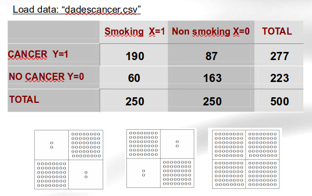
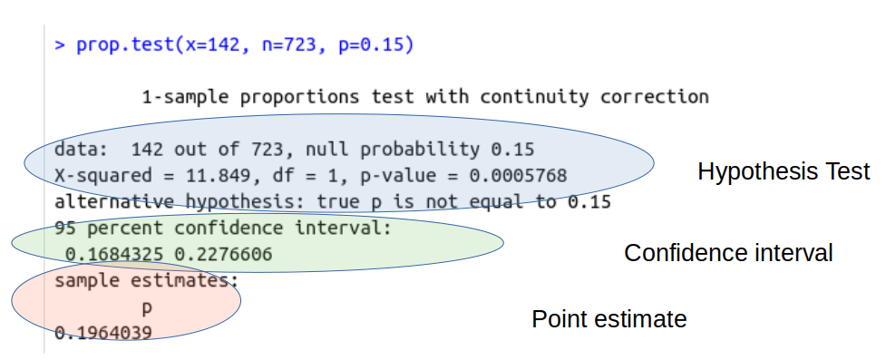
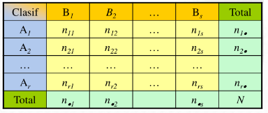
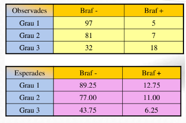

```{r setLicense, child = 'license.Rmd'}

```

```{r setup, include=FALSE}
knitr::opts_chunk$set(message = FALSE, warning=FALSE)
```

```{r echo=FALSE}
knitr::knit_hooks$set(mysize = function(before, options, envir) {
  if (before) 
    return(options$size)
})
```

# Introduction

- Categorical variables represent facts that can be better described with _labels_ than with numbers. 

    - Example: `Sex`, better choose from {`Male` , `Female`} than from: {1,2}.

- Sometimes ordering of labels makes sense, although _it is not reasonable to assign numbers to categories_:

    - Example: `Tumor stage`: {1,2,3,4}, but $1+2\neq 3$!!!

  - `Sex` is an example of a categorical variable in `nominal` scale
  
  - `Stage` is an example of a categorical variable in `ordinal` scale

# Representing categorical variables in R

- Categorical variables are well represented with _factors_

```{r}
sex <- factor(c("Female", "Male"))
blood_group <- factor(c("A", "B", "AB", "O"))
```

- Besides, factors can be forced to be "ordereded"

```{r}
tumorstage <- factor(1:4, ordered=TRUE)
```

- Be careful with the names of factors, by default, _levels_ assigned in alphabetical order.

```{r}
levels(blood_group)
```

# Creating factors

- Factors can be created ... 

  - automatically, when reading a file  or 
  
    - Not all functions for reading data from file will create a factor!!!
    - Usually levels will be defined from alphabetic order
  
  - using the `factor` or the `as.factor` commands.
    
    - more flexible
    
# Create factors automatically

- This is achieved by

  - Using the `read.table` or `read.delim` functions for reading
  
    - Setting the "character variables as.factors" to TRUE

- Example

  - Load the `diabetes` dataset using the `Import Dataset` feature of Rstudio
    - From text (base)      (use the file `diabetes.csv`)
    - From text (readr)     (use the file `diabetes.csv`)
    - From Excel            (use the file `diabetes.xls`)
  - What is the class of the variable `mort`

# Exercise 1

- Select one of the datasets that you have worked with during the course
    - diabetes.xls
    - osteoporosis.csv
    - demora.xls
    
 - Read the dataset into R and check that the categorical variables you are interested in are converted into factors.
 
 - Confirm the conversion by summarizing the variables
 
# Exercise 2
 
- Use the diabetes.sav file and import it into R with the "Import from SPSS" feature.

  - What is the class of the "MORT" variable.
  
  - Turn it into one factor so that it has the same levels as when you read it using `read.csv`
  


# The analysis of categorical variables

- The analysis of categorical data proceeds as usual:

 - Start exploring the data with the   tables and graphics
 - Proceed to estimation and/or testing if _appropriate_

- Estimation
  - Proportions: Point estimates, confidence intervals, Sample Size
    
- Testing
  - One variable (tests with proportions)
  - With two variables (chi-square and related)
  
  
# Types of test with categorical variables

- One variable (tests with proportions)
  - Does the proportion (% affected) match a given value?
  - Is the proportion (% affected) the same in two populations?

- With two variables (chi-square and related)

  - Is there an association between two categorical variables?
  - Is there a relationship between the values ​​of a categorical variable before and after treatment?


# Example

Consider the following study relating smoking and cancer.

```{r, echo=FALSE, out.width="80%", fig.cap=""}

```

Our goal here would be to determine if there is an association between smoking and cancer.

# Crosstabulating a dataset

- Data may come from a table (aggregated) or disagregated in a data file.

- In this case we need to build the table applying "cross-tabulation"

```{r}
dadescancer <- read.csv("datasets/dadescancer.csv", 
                        stringsAsFactors = TRUE)
```

```{r}
#attach(dadescancer)
mytable <-table(dadescancer$cancer, dadescancer$fumar)
mytable
```

# There are many ways to do crosstabulation

```{r}
with(dadescancer, table(cancer, fumar) )
```

```{r}
myXtable <- xtabs (~ cancer + fumar, data = dadescancer)
myXtable
```

# Crosstabulation (2): Marginal tables

Marginal values are important to understand the structure of the data:

```{r}
margin.table(mytable, 1) # A frequencies (summed over B)
margin.table(mytable, 2) # B frequencies (summed over A)
```

---

```{r}
addmargins(mytable)
```


# Crosstabulation (3): In percentages

Showing tables as percentages is useful for comparisons

```{r}
prop.table(mytable) # cell percentages
prop.table(mytable, 1) # row percentages
# prop.table(mytable, 2) # column percentages

```

# Exercise 3

- With the osteoporosis dataset repeat the crosstabulation done above using 

  - Two categorical variables
  - Variable "MENOP" and a newly created variable "catBUA" created by properly categorizing variable BUA.

# One variable: Proportion tests

- According to medical literature, in the period 1950-1980, the proportion of obese individuals (defined by medical criteria: BMI $\geq 30$) was 15% in the population of men over  55 years old.

- A random sample obtained from the same population between 2000 and 2003 showed that, over a total of 723 men older than 55, 142 were obese.

- Considering that the significance level that we use is 5%, can we say that the population of men older than 55 in 2000-2003 had the same 
proportion of obese cases than that population had in 50'-80'?

# Proportion tests with R

```{r}
prop.test(x=142, n=723, p=0.15)
```

# Estimation comes with proportion test

- `prop.test` does __three__ distinct calculations

    - A test for the hypothesis $H_0: p=p_0$ is performed
    - A confidence interval for $p$ is built based on the sample
    - A point estimate for $p$ is also provided.

```{r, echo=FALSE, out.width="100%", fig.cap=""}

```

# Exercise

- In the osteoporosis dataset
  
    - Test the hypothesis that the proportion of women with `osteoporosis` is higher than 7%
        - In the global population of the study
        - Only in women with osteoporosis
    - Select a sample of size 100 and repeat the test. How do the results change?
    - What sample size should we have taken so that th precision of the confidence intervals would have been at most 3% with a probability of 95%?
    
    
# Contingency tables

- A contingency table (a.k.a cross tabulation or cross tab) is a matrix-like table that displays the (multivariate) frequency distribution of the variables.

- It is bidimensional, and classifies
all observations according with 
two qualitative variables 
(A and B, rows and columns).

```{r, echo=FALSE, out.width="80%", fig.cap=""}

```

# Chi-squared test

**Chi squared independence test**

- When the sample comes from a single population with 2 qualitative variables, the aim is to determine if there is relationship between vars:


**Chi squared homogeneity test** 

- When each row is a sample from distinct populations (groups, subgroups...), the aim is to determine if both groups have significative differences in that variable

# Chi-squared tests

- When we have:

    - quantitative data, 
    - one or more categories, 
    - independent observations, 
    - adequate sample size (>10)

- and our questions are like...

    - _Do the number of individuals or objects that fall in each category differ significantly from the number you would expect? _

    - _Is this difference between the expected and observed due to sampling variation, or is it a real difference?_

# Chi squared.test: Observed vs expected

```{r, echo=FALSE, out.width="80%", fig.cap=""}

```

# Chi squared tests with R

```{r}
mytable<- with(dadescancer, table(cancer, fumar) )
chisq.test (mytable)
```

Alternatively use Fisher test

```{r}
fisher.test(mytable)
```

# Exercise

- Use the osteoporosis dataset to study if it can be detected an association between the variables `menop` and `classific` in the osteoporosis dataset.

- Do not start with a test but with an appropriate summarization and visualization!


